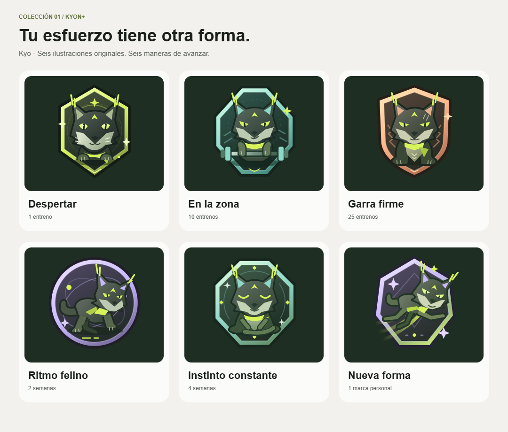

# Kyo · Colección 01

Ilustraciones vectoriales originales creadas para Kyon+: lince carbón, mechones y pañuelo lima, marca geométrica en la frente y seis poses diferentes. No se utilizó el generador de imágenes de ChatGPT ni material gráfico externo.

| Nombre | Condición | SVG maestro | PNG transparente |
| --- | --- | --- | --- |
| Despertar | Primer entrenamiento válido | [SVG](../../../public/badges/kyo-despertar.svg) | [1024 px](kyo-despertar.png) |
| En la zona | 10 entrenamientos únicos | [SVG](../../../public/badges/kyo-en-la-zona.svg) | [1024 px](kyo-en-la-zona.png) |
| Garra firme | 25 entrenamientos únicos | [SVG](../../../public/badges/kyo-garra-firme.svg) | [1024 px](kyo-garra-firme.png) |
| Ritmo felino | 2 semanas consecutivas | [SVG](../../../public/badges/kyo-ritmo-felino.svg) | [1024 px](kyo-ritmo-felino.png) |
| Instinto constante | 4 semanas consecutivas | [SVG](../../../public/badges/kyo-instinto-constante.svg) | [1024 px](kyo-instinto-constante.png) |
| Nueva forma | Superar la fuerza estimada de una sesión anterior | [SVG](../../../public/badges/kyo-nueva-forma.svg) | [1024 px](kyo-nueva-forma.png) |

## Uso

- SVG: `viewBox="0 0 256 256"`, sin fuentes, scripts ni imágenes enlazadas. El exterior de cada insignia es transparente; su interior forma parte del diseño.
- PNG: 1024 × 1024 RGBA, mismo diseño y transparencia exterior. Exportado desde los SVG; no cargado por la app.
- En interfaz: 31 px para chips, 66–80 px para el próximo hito y 174–238 px para la vitrina y su detalle. El texto se renderiza fuera de las imágenes.
- Paleta: lima `#D7F45B`, carbón `#1B201A`, menta `#8ED8C8`, melocotón `#FFB98A`, lavanda `#C7B8FF`.
- Se conservan proporciones, ojos, mechones y pañuelo en las seis versiones. Evitar deformaciones, recortes y cambios de color que oculten su identidad.
- Las animaciones pertenecen a `FriendsView.css`, no a los archivos. Los originales siguen siendo reutilizables y estáticos. Con movimiento reducido se desactivan animaciones y transiciones.
- Las condiciones se validan en servidor. Las rachas requieren al menos una sesión semanal (lunes–domingo UTC), no ejercicio diario. Los textos de la colección no recomiendan entrenar más allá del plan personal.

Ver también la [galería HTML](../../kyo-collection.html).
